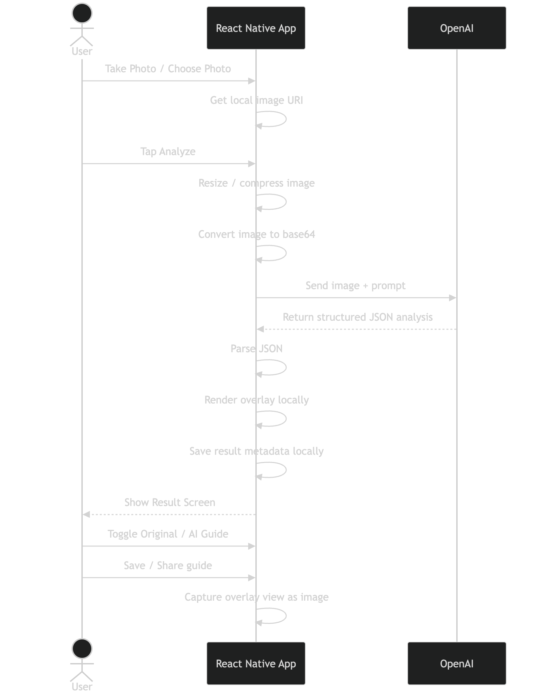

# Technical Spec — AI Photo Coach MVP (React Native)

## 1. Mục tiêu kỹ thuật

App cho phép user:

- chụp ảnh hoặc chọn ảnh từ thư viện
- preview ảnh
- gửi ảnh trực tiếp lên OpenAI
- nhận về:
  - score
  - sub-scores
  - summary
  - strengths
  - issues
  - suggestions
  - visual guide instructions
- app tự render AI Guide image từ ảnh gốc + overlay instructions
- user xem:
  - Original
  - AI Guide
- save/share kết quả

## 2. Kiến trúc tổng thể

### 2.1 Tech stack đề xuất

#### App

- React Native
- TypeScript
- React Navigation
- Zustand hoặc Redux Toolkit
- React Query hoặc custom async hooks
- react-native-image-picker hoặc expo-image-picker
- react-native-view-shot
- react-native-svg
- react-native-fs hoặc expo-file-system
- react-native-share
- react-native-permissions

#### AI integration

- OpenAI Responses API hoặc chat/vision-compatible endpoint
- Gọi trực tiếp từ app qua HTTPS

#### Local persistence

- AsyncStorage hoặc MMKV

Lưu:

- recent analyses metadata
- cached responses
- local rendered guide path

## 3. Kiến trúc module

```text
src/
 ├── app/
 │    ├── navigation/
 │    ├── providers/
 │    └── store/
 ├── features/
 │    ├── home/
 │    ├── photo-capture/
 │    ├── photo-preview/
 │    ├── analysis/
 │    ├── result/
 │    └── history/
 ├── services/
 │    ├── openai/
 │    ├── image/
 │    ├── storage/
 │    └── share/
 ├── components/
 │    ├── common/
 │    ├── score/
 │    └── overlay/
 ├── models/
 ├── hooks/
 ├── utils/
 └── constants/
```

## 4. Kiến trúc màn hình

### 4.1 Screens

- HomeScreen
- PhotoSourceScreen (optional nếu muốn tách)
- PhotoPreviewScreen
- AnalyzingScreen
- ResultScreen
- HistoryScreen

### 4.2 Navigation flow

```text
Home
 ├── Take Photo -> Preview
 ├── Choose Photo -> Preview
 └── History -> Result

Preview
 └── Analyze -> Analyzing -> Result
```

## 5. Data flow chính

### 5.1 Happy path

- user chọn/chụp ảnh
- app normalize ảnh
- app convert ảnh sang input phù hợp cho OpenAI
- app gửi request
- app parse JSON output
- app map JSON thành AnalysisResult
- app render overlay trên ảnh gốc
- app cho user xem Original / AI Guide
- app lưu metadata vào local history

## 6. Lưu ý quan trọng về gọi OpenAI trực tiếp từ app

### 6.1 Có thể làm cho MVP demo

Cách này phù hợp nếu mục tiêu là:

- test UX
- validate idea
- demo nội bộ
- build very early MVP

### 6.2 Rủi ro

Vì gọi trực tiếp từ app:

- API key có nguy cơ bị lộ
- khó rate-limit
- khó rotate secret
- khó kiểm soát abuse
- khó validate response tập trung

### 6.3 Khuyến nghị

Cho giai đoạn hiện tại có thể làm:

- dùng 1 key riêng cho prototype
- scope usage budget chặt
- bật monitoring
- obfuscate ở mức cơ bản
- chấp nhận đây là giải pháp tạm

Production không nên giữ kiến trúc này.

## 7. Model dữ liệu

### 7.1 Domain model

```ts
export type ScoreCategory =
  | 'composition'
  | 'pose'
  | 'camera_angle'
  | 'background'
  | 'lighting'
  | 'framing'
  | 'scene_balance';

export interface Suggestion {
  title: string;
  description: string;
}

export interface CropRectNormalized {
  x: number; // 0...1
  y: number; // 0...1
  w: number; // 0...1
  h: number; // 0...1
}

export interface OverlayArrow {
  from: [number, number]; // normalized
  to: [number, number];   // normalized
  label?: string;
}

export interface OverlayNote {
  x: number;
  y: number;
  text: string;
}

export interface OverlayData {
  grid?: boolean;
  cropRect?: CropRectNormalized;
  arrows?: OverlayArrow[];
  notes?: OverlayNote[];
}

export interface VisualOutput {
  type: 'annotated_image' | 'overlay_only';
  localRenderedPath?: string;
}

export interface AnalysisResult {
  analysisId: string;
  overallScore: number;
  subscores: Partial<Record<ScoreCategory, number>>;
  summary: string;
  strengths: string[];
  issues: string[];
  suggestions: Suggestion[];
  overlayData?: OverlayData;
  visualOutput?: VisualOutput;
  createdAt: string;
  originalImageUri: string;
}
```

## 8. Local state design

### 8.1 Global state

Dùng Zustand:

```ts
interface AnalysisStore {
  currentPhotoUri?: string;
  currentResult?: AnalysisResult;
  recentResults: AnalysisResult[];
  isAnalyzing: boolean;
  error?: string;

  setCurrentPhoto: (uri: string) => void;
  setAnalyzing: (value: boolean) => void;
  setCurrentResult: (result: AnalysisResult) => void;
  addRecentResult: (result: AnalysisResult) => void;
  setError: (message?: string) => void;
  clearCurrent: () => void;
}
```

### 8.2 Query state

Nếu dùng React Query:

- mutation cho analyze photo
- query cho history local thì không cần
- render overlay là async local task riêng

## 9. Chọn ảnh / chụp ảnh

### 9.1 Chọn package

Nếu RN CLI:

- react-native-image-picker

Nếu Expo:

- expo-image-picker

### 9.2 Yêu cầu

Cần lấy được:

- uri
- width
- height
- fileName
- type
- fileSize

### 9.3 Validation

Trước khi gửi AI:

- file tồn tại
- ảnh không quá nhỏ, ví dụ:
  - min width >= 512
  - min height >= 512
- file size dưới ngưỡng cho phép, ví dụ 10MB
- nếu quá lớn thì resize/compress trước

## 10. Image preprocessing

### 10.1 Mục tiêu

Giảm:

- latency
- token / bandwidth cost
- crash risk

### 10.2 Đề xuất

Resize long edge về khoảng:

- 1280 hoặc 1536 px

JPEG quality:

- 0.7–0.85

### 10.3 Thư viện đề xuất

- @bam.tech/react-native-image-resizer
- hoặc
- expo image manipulator nếu dùng Expo

### 10.4 Output

App giữ:

- original uri
- optimized uri để gửi lên OpenAI

## 11. Gọi OpenAI trực tiếp từ app

### 11.1 Luồng đề xuất cho MVP

App sẽ gửi:

- prompt text
- ảnh dưới dạng image input

AI trả về:

- JSON structured analysis

Sau đó app:

- parse JSON
- render overlay locally

### 11.2 Cách tổ chức service

- src/services/openai/openaiClient.ts
- src/services/openai/analyzePhoto.ts
- src/services/openai/promptBuilder.ts
- src/services/openai/responseParser.ts

### 11.3 OpenAI service interface

```ts
export interface AnalyzePhotoInput {
  imageBase64: string;
  mimeType: string;
}

export interface AnalyzePhotoOutput extends AnalysisResult {}
```

### 11.4 Prompt builder

```ts
export const buildPhotoAnalysisPrompt = () => `
You are an expert mobile photography coach.

Analyze the user photo and return JSON only.

Requirements:
- Provide overall_score from 0.0 to 10.0
- Provide subscores relevant to the image
- Provide one concise summary
- Provide up to 3 strengths
- Provide up to 3 issues
- Provide up to 3 actionable suggestions
- Provide overlay_data for rendering an annotated guide on top of the original image

Rules:
- Keep feedback concise and practical
- Do not mention sensitive attributes
- Do not shame the subject
- Suggestions must be specific to the visible image
- Output must be valid JSON

JSON schema:
{
  "overall_score": number,
  "subscores": {
    "composition": number,
    "pose": number,
    "camera_angle": number,
    "background": number,
    "lighting": number,
    "framing": number,
    "scene_balance": number
  },
  "summary": string,
  "strengths": string[],
  "issues": string[],
  "suggestions": [
    { "title": string, "description": string }
  ],
  "overlay_data": {
    "grid": boolean,
    "cropRect": { "x": number, "y": number, "w": number, "h": number },
    "arrows": [
      {
        "from": [number, number],
        "to": [number, number],
        "label": string
      }
    ],
    "notes": [
      { "x": number, "y": number, "text": string }
    ]
  }
}
`;
```

### 11.5 Service gọi API

Ví dụ TypeScript:

```ts
const OPENAI_API_KEY = 'YOUR_OPENAI_API_KEY';
const OPENAI_URL = 'https://api.openai.com/v1/responses';

export async function analyzePhotoWithOpenAI(
  imageBase64: string,
  mimeType: string,
): Promise<any> {
  const response = await fetch(OPENAI_URL, {
    method: 'POST',
    headers: {
      'Content-Type': 'application/json',
      Authorization: `Bearer ${OPENAI_API_KEY}`,
    },
    body: JSON.stringify({
      model: 'gpt-4.1-mini',
      input: [
        {
          role: 'system',
          content: [
            {
              type: 'input_text',
              text: buildPhotoAnalysisPrompt(),
            },
          ],
        },
        {
          role: 'user',
          content: [
            {
              type: 'input_text',
              text: 'Analyze this photo and return JSON only.',
            },
            {
              type: 'input_image',
              image_url: `data:${mimeType};base64,${imageBase64}`,
            },
          ],
        },
      ],
    }),
  });

  if (!response.ok) {
    throw new Error(`OpenAI request failed: ${response.status}`);
  }

  return response.json();
}
```

### 11.6 Parse response

Bạn nên tách parser riêng vì response format có thể thay đổi.

```ts
export function extractJsonTextFromResponse(raw: any): string {
  const outputs = raw?.output ?? [];
  for (const item of outputs) {
    const content = item?.content ?? [];
    for (const c of content) {
      if (c?.type === 'output_text' && typeof c?.text === 'string') {
        return c.text;
      }
    }
  }
  throw new Error('No output text returned from OpenAI');
}

export function parseAnalysisResponse(
  raw: any,
  originalImageUri: string,
): AnalysisResult {
  const jsonText = extractJsonTextFromResponse(raw);
  const parsed = JSON.parse(jsonText);

  return {
    analysisId: `${Date.now()}`,
    overallScore: parsed.overall_score ?? 0,
    subscores: parsed.subscores ?? {},
    summary: parsed.summary ?? '',
    strengths: parsed.strengths ?? [],
    issues: parsed.issues ?? [],
    suggestions: parsed.suggestions ?? [],
    overlayData: parsed.overlay_data,
    createdAt: new Date().toISOString(),
    originalImageUri,
  };
}
```

## 12. Convert ảnh sang base64

### 12.1 Đề xuất

Dùng:

- react-native-fs
- hoặc
- Expo FileSystem

Ví dụ:

```ts
import RNFS from 'react-native-fs';

export async function fileToBase64(uri: string): Promise<string> {
  const normalized = uri.startsWith('file://') ? uri.replace('file://', '') : uri;
  return RNFS.readFile(normalized, 'base64');
}
```

## 13. Render AI Guide locally

Đây là phần quan trọng nhất trong MVP.

### 13.1 Cách làm

Result screen sẽ render:

- ảnh gốc
- layer overlay bằng SVG

Sau đó nếu user muốn save/share:

- dùng react-native-view-shot capture toàn bộ view thành image file

### 13.2 Overlay renderer

Component:

- OverlayGuide.tsx

Input:

- image width/height hiển thị trên UI
- overlayData

Overlay gồm:

- grid
- crop rect
- arrows
- notes

### 13.3 Vì sao dùng SVG

- dễ vẽ normalized coordinates
- dễ scale theo kích thước ảnh hiển thị
- dễ maintain hơn canvas

### 13.4 Ví dụ component

```tsx
import React from 'react';
import Svg, { Rect, Line, Text as SvgText } from 'react-native-svg';

interface Props {
  width: number;
  height: number;
  overlayData?: OverlayData;
}

export function OverlayGuide({ width, height, overlayData }: Props) {
  if (!overlayData) return null;

  const crop = overlayData.cropRect;

  return (
    <Svg width={width} height={height} style={{ position: 'absolute', top: 0, left: 0 }}>
      {overlayData.grid && (
        <>
          <Line x1={width / 3} y1={0} x2={width / 3} y2={height} stroke="white" strokeWidth={1} />
          <Line x1={(width * 2) / 3} y1={0} x2={(width * 2) / 3} y2={height} stroke="white" strokeWidth={1} />
          <Line x1={0} y1={height / 3} x2={width} y2={height / 3} stroke="white" strokeWidth={1} />
          <Line x1={0} y1={(height * 2) / 3} x2={width} y2={(height * 2) / 3} stroke="white" strokeWidth={1} />
        </>
      )}

      {crop && (
        <Rect
          x={crop.x * width}
          y={crop.y * height}
          width={crop.w * width}
          height={crop.h * height}
          stroke="yellow"
          strokeWidth={2}
          fill="transparent"
        />
      )}

      {overlayData.arrows?.map((arrow, index) => (
        <Line
          key={`arrow-${index}`}
          x1={arrow.from[0] * width}
          y1={arrow.from[1] * height}
          x2={arrow.to[0] * width}
          y2={arrow.to[1] * height}
          stroke="cyan"
          strokeWidth={3}
        />
      ))}

      {overlayData.notes?.map((note, index) => (
        <SvgText
          key={`note-${index}`}
          x={note.x * width}
          y={note.y * height}
          fill="white"
          fontSize="14"
        >
          {note.text}
        </SvgText>
      ))}
    </Svg>
  );
}
```

## 14. Save / Share flow

### 14.1 Save AI Guide

Flow:

- render original image + overlay
- capture bằng react-native-view-shot
- lưu file ảnh tạm
- save vào Photos hoặc share sheet

### 14.2 Thư viện

- react-native-view-shot
- @react-native-camera-roll/camera-roll
- react-native-share

## 15. History persistence

### 15.1 Lưu gì

Chỉ lưu:

- analysis metadata
- original image uri
- local rendered guide path nếu có
- createdAt
- overallScore
- summary

### 15.2 Không lưu gì

- raw base64
- raw huge response không cần thiết

### 15.3 Storage

- MMKV nếu muốn nhanh
- AsyncStorage nếu đơn giản

## 16. Error handling

### 16.1 Các loại lỗi

- user deny photo permission
- invalid image
- resize failure
- base64 conversion failure
- OpenAI request failure
- invalid JSON response
- overlay render failure
- save/share failure

### 16.2 UX hiển thị

Nên map ra message dễ hiểu:

- “Không thể đọc ảnh này.”
- “Không thể gửi ảnh để phân tích.”
- “AI chưa trả về kết quả hợp lệ.”
- “Không thể tạo ảnh hướng dẫn.”

## 17. Security note cho direct OpenAI call

### 17.1 Hardcoded key

Không nên hardcode plain text trong source.

### 17.2 MVP workaround

Có thể dùng:

- env injection lúc build
- key riêng cho internal prototype
- budget limit thấp
- monitoring usage

### 17.3 Chốt

Spec nên note rõ:

- direct call là temporary architecture only.

## 18. Folder spec chi tiết

### 18.1 services/openai

- openaiClient.ts
- analyzePhoto.ts
- promptBuilder.ts
- responseParser.ts

### 18.2 services/image

- resizeImage.ts
- fileToBase64.ts
- captureGuideImage.ts

### 18.3 features/photo-preview

- PhotoPreviewScreen.tsx
- useAnalyzePhoto.ts

### 18.4 features/result

- ResultScreen.tsx
- OriginalGuideToggle.tsx
- ScoreCard.tsx
- SuggestionsList.tsx
- OverlayGuide.tsx

## 19. Hook đề xuất

### 19.1 useAnalyzePhoto

```ts
export function useAnalyzePhoto() {
  const setAnalyzing = useAnalysisStore(s => s.setAnalyzing);
  const setCurrentResult = useAnalysisStore(s => s.setCurrentResult);
  const addRecentResult = useAnalysisStore(s => s.addRecentResult);
  const setError = useAnalysisStore(s => s.setError);

  const analyze = async (imageUri: string, mimeType: string) => {
    try {
      setError(undefined);
      setAnalyzing(true);

      const optimizedUri = await resizeImageIfNeeded(imageUri);
      const base64 = await fileToBase64(optimizedUri);

      const raw = await analyzePhotoWithOpenAI(base64, mimeType);
      const parsed = parseAnalysisResponse(raw, imageUri);

      setCurrentResult(parsed);
      addRecentResult(parsed);

      return parsed;
    } catch (error: any) {
      setError(error?.message ?? 'Analysis failed');
      throw error;
    } finally {
      setAnalyzing(false);
    }
  };

  return { analyze };
}
```

## 20. UI rendering rule

### 20.1 Result screen sections

- hero image area
- toggle: Original / AI Guide
- score card
- summary
- subscore chips
- strengths
- issues
- suggestions
- actions: save/share

### 20.2 Toggle behavior

- Original: chỉ hiện ảnh gốc
- AI Guide: hiện ảnh gốc + overlay
- nếu overlayData thiếu, disable AI Guide tab

## 21. Analytics spec đơn giản

Track:

- photo_selected
- photo_captured
- analysis_started
- analysis_succeeded
- analysis_failed
- guide_viewed
- guide_saved
- guide_shared

## 22. Performance targets

- thời gian resize: < 1.5s
- upload + OpenAI response: 4–12s tùy mạng
- render overlay: gần như tức thời
- result screen first paint: < 500ms sau khi parse xong

## 23. Acceptance criteria kỹ thuật

- App chọn/chụp được 1 ảnh.
- App resize/compress được ảnh trước khi gửi.
- App convert ảnh sang base64.
- App gọi trực tiếp OpenAI thành công.
- App parse được JSON response hợp lệ.
- App render được overlay local từ overlayData.
- App toggle được giữa Original và AI Guide.
- App save/share được ảnh AI Guide.
- App lưu local history tối thiểu.
- App xử lý các lỗi cơ bản mà không crash.

## 24. Flow sequence diagram

### 24.1 Main flow

```text
User
  |
  v
React Native App
  |
  |-- Take Photo / Choose Photo
  |
  v
Image Picker / Camera
  |
  |-- return local image URI
  |
  v
React Native App
  |
  |-- preprocess image (resize/compress)
  |-- convert image to base64
  |
  |-- POST request directly to OpenAI
  v
OpenAI
  |
  |-- analyze image + generate structured JSON
  |
  v
React Native App
  |
  |-- parse JSON response
  |-- map to AnalysisResult
  |-- render overlay on original image
  |-- save result metadata locally
  |
  v
Result Screen
  |
  |-- show Original
  |-- show AI Guide
  |-- save/share guide image
```

### 24.2 Sequence diagram chi tiết hơn

```text
+--------+             +------------------+             +--------+
|  User  |             | React Native App |             | OpenAI |
+--------+             +------------------+             +--------+
    |                           |                            |
    | choose/take photo         |                            |
    |-------------------------->|                            |
    |                           | open picker/camera         |
    |                           |--------------------------->|
    |                           | (system component locally) |
    |                           |<---------------------------|
    |                           | receive image URI          |
    |                           |                            |
    | tap Analyze               |                            |
    |-------------------------->|                            |
    |                           | resize/compress image      |
    |                           | convert to base64          |
    |                           |                            |
    |                           | send request               |
    |                           |--------------------------->|
    |                           | image + prompt             |
    |                           |                            |
    |                           |<---------------------------|
    |                           | structured JSON result     |
    |                           |                            |
    |                           | parse result               |
    |                           | render overlay locally     |
    |                           | persist local history      |
    |                           |                            |
    |                           | show result screen         |
    |<--------------------------|                            |
    |                           |                            |
    | toggle AI Guide           |                            |
    |-------------------------->|                            |
    |                           | show overlay version       |
    |<--------------------------|                            |
    |                           |                            |
    | save/share                |                            |
    |-------------------------->|                            |
    |                           | capture view as image      |
    |                           | save/share output          |
    |<--------------------------|                            |
```

## 25. Mermaid sequence diagram

Nếu team muốn copy vào docs:



## 26. Roadmap kỹ thuật đề xuất

### Phase 1

- image picker/camera
- preview
- OpenAI direct call
- basic result rendering

### Phase 2

- overlay renderer
- save/share
- history local

### Phase 3

- stabilize response parsing
- caching
- retry logic
- analytics

### Phase 4

- tách backend sau
- chuyển key ra server
- rate limit
- central logging

## 27. Khuyến nghị cuối

Với hướng MVP này, nên chốt implementation như sau:

- OpenAI chỉ trả structured analysis
- React Native tự render AI Guide trên ảnh gốc
- chưa cần để OpenAI sinh hẳn ảnh edited
- direct API call chỉ dùng cho prototype / internal MVP

Như vậy sẽ:

- build nhanh hơn
- ít random hơn
- dễ debug hơn
- chi phí thấp hơn

Ở bước tiếp theo, mình có thể viết tiếp cho bạn 1 bản code skeleton React Native TypeScript, gồm:

- folder structure
- types
- store Zustand
- service gọi OpenAI
- screen Preview / Result
- component OverlayGuide
